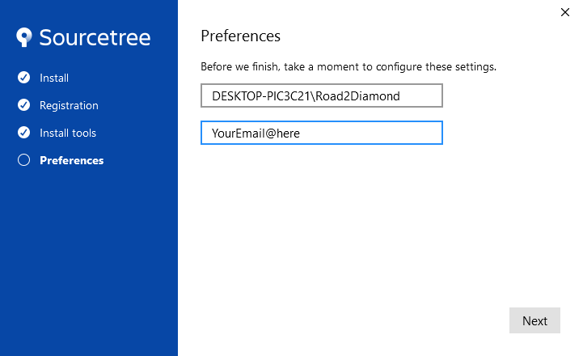

# Initial MyBotRun xbebenk MOD Setup

## Installation QuickLinks
[Step 1: BlueStacks](InitialSetup.md#bluestacks)  
[Step 2: Amazon Clash of Clans Install](InitialSetup.md#cocinstall)  
[Step 3: SourceTree](InitialSetup.md#sourcetree)  
[Step 4: AutoIt](InitialSetup.md#autoit)  
[Step 5: RivaTuner](InitialSetup.md#rivatuner)  

## BlueStacks Installation
* Download the BlueStacks Setup file
* Double click on BlueStacksInstaller.exe
  * if a User Account Control window appears, select Yes    

* Click the "Install Now" button and close the BlueStacks application once the installation is complete. 

* Open the "BlueStacks 5 Multi-Instance Manager" on your desktop.
By default, each instance will be named "BlueStacks App Player" followed by a number, but you can rename them to something more memorable. Keep in mind, you will need to remember these names later on when you begin using the bot. 
* BlueStacks naming conventions
  * Nougat32
  * Nougat32_1
  * Nougat32_2
  * etc

* Open the BlueStacks 5 Multi-Instance Manager, and click on the gear icon next to the BlueStacks instance you wish to configure. 

* Under the Performance tab, adjust the following settings:
  * CPU allocation: Low (1Core)
  * Memory allocation: low (1GB)
  * Frame rate: 20
* Click "Save Changes" and then click on the gear icon again to re-open the settings menu.

* Select "Display" from the left tab menu and change the following settings:
  * Display Resolution: Custom 
    * Click Add resolution
    * Width = 860
    * Height = 676
    * Click save on the right of the resolution menu
    * Select the 860 x 676 radio button
  * Pixel density: 160 DPI (Low)
  * Click "Save Changes" and then click on the gear icon again to re-open the settings menu.

* Select "Graphics" from the left tab menu and change the following settings:
  * Graphics engine mode: Compatibility
* Click "Save Changes".

### Install the Amazon Appstore and Clash of Clans on the BlueStacks Instance by following these steps:
* From the BlueStacks 5 Multi-Instance Manager, start the first BlueStacks instance.

* Once Loaded, click on the "System apps" folder and open Chrome.
* Go to Amazon.com and search for "Amazon Appstore".

* Download and Install the Amazon Appstore

* Click Get Amazon AppStore.

* Click Ok on the security pop up at the bottom of the screen.

* Click Open on the pop up at the bottom of the screen.

* Click Install.

* Click Open.

* Click Sign In or Create a new Amazon Account.

* Once Signed in, Search for Clash of Clans and Install it.

* Click Install on the pop up.
* Close the BlueStacks session when the installation is complete and open the Multi-Instance Manager.

* Click the "Clone Instance" button to create a copy of the first BlueStacks instance

* Repeat these steps to create additional BlueStacks instances and make sure to name them accordingly (e.g. "Nougat32", "Nougat32_1", "Nougat32_2", etc.) for use with the bot.
  * Instance count can be changed to 2 or more (*Not all machines can handle more than 2. This will be based on your machines performance*)

*BlueStacks Installation and configuration complete*

## SourceTree Installation
* Download the Sourcetree Setup file
* Double click on SourcetreeSetup.exe
  * if a User Account Control window appears, select Yes   

* Click Skip on the Registration Menu

* Click Next

* Click Cancel on the error message

* Click Next

* Enter your email and click Next

* Select No

**Once the setup is successful, you'll see a window like below:**  

* Click "Clone" from the top menu in Sourcetree.

  
**Source Path:** https://github.com/xbebenk/MBR_xbebenkMOD  
**Destination Path:** Enter the directory where you want to save the MBR folder.  
*In my instance, I created a folder on the desktop called xbeb, so the Destination path for me was C:\Users\User\Desktop\xbeb*    
**Name:** Choose a name for your folder.

* Click "Clone" to download xbebenkmod and save it in the given folder.

  
Successfully cloned xbebenkMOD on your desktop

  
Verify the folder structure that was cloned

*Sourcetree Installation Complete*

## AutoIt Installation
* Download the AutoIt setup file and double click on AutoIt-Setup.exe
  * if a User Account Control window appears, select Yes    

* Click Next and **leave all defaults selected during the installation**  

* Click I Agree  

* Click Next  

* Click Next  

* Click Next  

* Click Install  

* Click Finish  

**After installation is complete, add AutoIt to the system variable path**  

* Click on the Windows Start Menu and type "Path" and open "Edit the system environment variables"  

* The System Properties menu will load, select Environment Variables at the bottom of the screen menu  

* Select Path on **System Variables** and click Edit

* Click New and add the AutoIt folder there "C:\Program Files (x86)\AutoIt3"

*AutoIt Installation Complete*

## RivaTuner Installation 
* Download the RivaTuner setup file and double click on RTSSSetup732.exe
  * if a User Account Control window appears, select Yes      

* Select Ok and **leave all defaults selected during the installation**

* Select Next

* Select "I accept" radio button and click Next

* Select Next

* Select Install

* Click Finish

**After installation is complete, edit Riva Tuner settings**  

* Click the Windows Start Menu and search for RivaTuner and select "RivaTuner Statistics Server"
  * if a User Account Control window appears, select Yes    

* Click OK on the DirectX Warning

* Click "No" on the Download Page Menu **DO NOT UPDATE**

* RivaTuner will now open and display as an icon on the task tray on the bottom right above the clock. Click on the icon to open RivaTuner.

  
**Once Riva Tuner is open, navigate to the settings and change the following:**
* Settings
  * Start with Windows "On"
  * Application Detection level "High"
  * Framerate limit "20"

* Minimize RivaTuner **DO NOT Close**

## MemReduct Installation 

## Installation Complete
Congratulations, you have successfully installed RivaTuner. Continue to the usage page for further instructions on how to use it.     
[MyBotRun Usage](Usage.md)  
