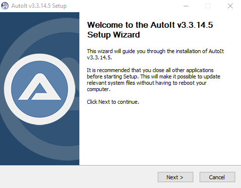
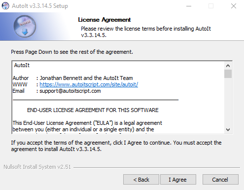
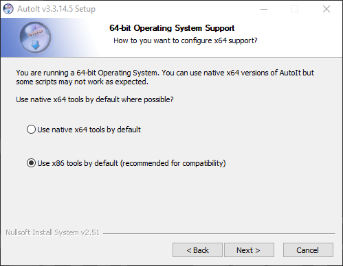
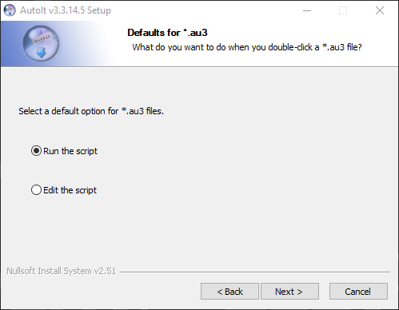
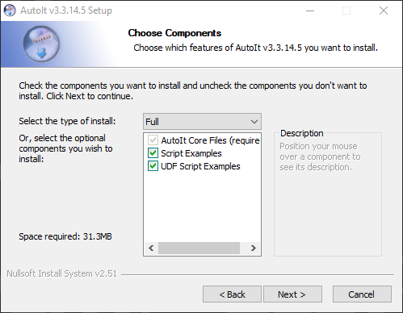
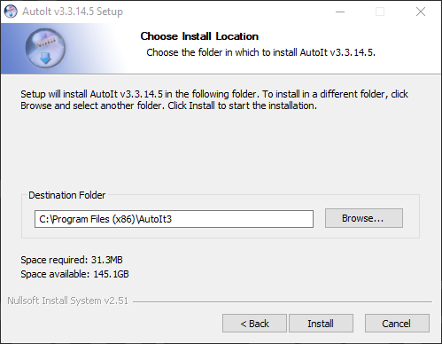
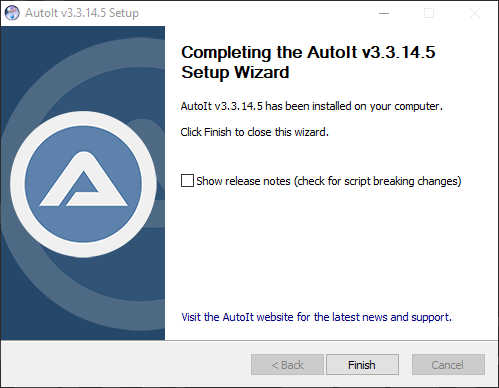
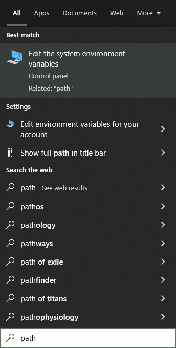

# MBR-xbebenk
The installation files and instructions for MyBotRun xbebenk 

**Note:** *It is Recommended to run MyBotRun on a computer that you **DO NOT** use on a regular basis due to it running 24/7*

## Needed files included in Repo
* AutoIt (3.3.14.5)
* BlueStacksInstaller (5.9.140.1014)
* SourceTree

## AutoIt Installation
* Download the AutoIt Setup file
* Double click on AutoIt-Setup.exe
  * if a User Account Control window appears, select Yes
* Click Next and **leave all defaults**  

* Click I Agree  

* Click Next  

* Click Next  

* Click Next  

* Click Install  

* Click Finish  

**After installation is complete**
* Click on the Windows Start Menu and type "Path" and click on "Edit the system environment variables"  

* The System Properties menu will load, select Environment Variables button at the bottom of the screen menu  

* On the new menu se

## 
