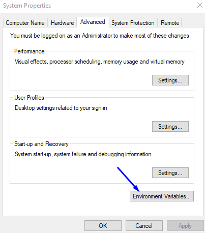
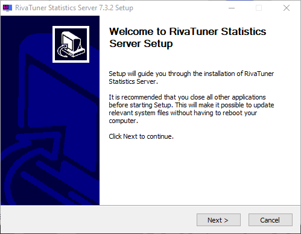
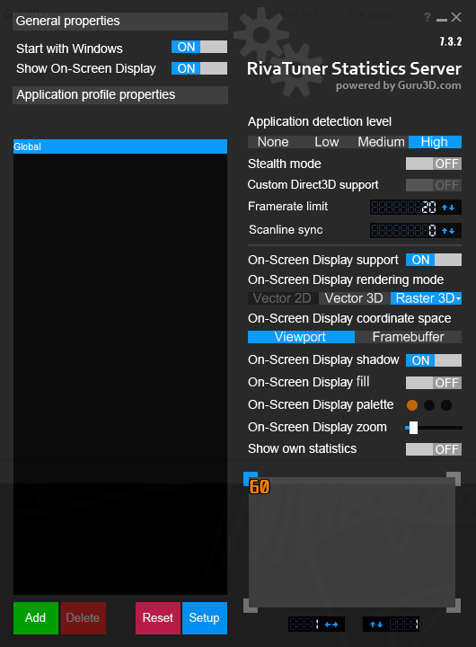

# MBR-xbebenk
The installation files and instructions for MyBotRun xbebenk 

**Note:** *It is Recommended to run MyBotRun on a computer that you **DO NOT** use on a regular basis due to it running 24/7*

## Needed files included in Repo
* BlueStacksInstaller (5.9.140.1014)
* SourceTree
* AutoIt (3.3.14.5)
* RivaTuner

# Installation QuickLinks
[BlueStacks](#bluestacks)  
[SourceTree](#sourcetree)  
[AutoIt](#autoit)  
[RivaTuner](#rivatuner)  

## BlueStacks Installation
* Download the BlueStacks Setup file
* Double click on BlueStacksInstaller.exe
  * if a User Account Control window appears, select Yes    

* Click Install Now and close BlueStacks out once it is open. 
* Go to your desktop and double-click on "BlueStacks 5 Multi-Instance Manager"
By default BlueStacks will name each instance "BlueStacks App Player" with a number behind it. 
You can rename this to anything you want, but take note that you MUST remember the following naming later on once we start the bot. 
* BlueStacks Data Naming
  * Nougat32
  * Nougat32_1
  * Nougat32_2
  * etc

* Click on the gear to the right of the BlueStacks instance

* On Performance change the following Settings:
  * CPU allocation: Low (1Core)
  * Memory allocation: low (1GB)
  * Frame rate: 20
* Click Save Changes and click on the gear again.

* Select Display on the left tab menu and change the following settings:
  * Display Resolution: Custom 
    * Click Add resolution
    * Width = 860
    * Height = 676
    * Click save on the right of the resolution menu
    * Select the 860 x 676 radio button
  * Pixel density: 160 DPI (Low)

## SourceTree Installation

## AutoIt Installation
* Download the AutoIt Setup file
* Double click on AutoIt-Setup.exe
  * if a User Account Control window appears, select Yes    

* Click Next and **leave all defaults selected**  

* Click I Agree  

* Click Next  

* Click Next  

* Click Next  

* Click Install  

* Click Finish  

**After installation is complete, add AutoIt to the system variable path**  

* Click on the Windows Start Menu and type "Path" and open "Edit the system environment variables"  

* The System Properties menu will load, select Environment Variables at the bottom of the screen menu  

* Select Path on **System Variables** and click Edit

* Click New and add the AutoIt folder there "C:\Program Files (x86)\AutoIt3"

*AutoIt Installation Complete*

## RivaTuner Installation 
* Download the RivaTuner Setup file
* Double Click on RTSSSetup732.exe
  * if a User Account Control window appears, select Yes      

* Select Ok and **Leave all defaults selected**

* Select Next

* Select "I accept" radio button and click Next

* Select Next

* Select Install

* Click Finish

**After installation is complete, edit Riva Tuner settings**  

* Click the Windows Start Menu and search for RivaTuner and select "RivaTuner Statistics Server"
  * if a User Account Control window appears, select Yes    

* Click OK on the DirectX Warning

* Click "No" on the Download Page Menu **DO NOT UPDATE**

* RivaTuner will now open and display as an icon on the task tray on the bottom right above the clock. Click on the icon to open RivaTuner.

  
**Once Riva Tuner is open change the following settings**
* Settings
  * Start with Windows "On"
  * Application Detection level "High"
  * Framerate limit "20"

* Minimize RivaTuner **DO NOT Close**
