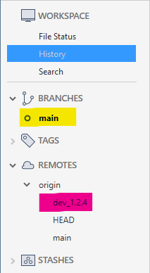
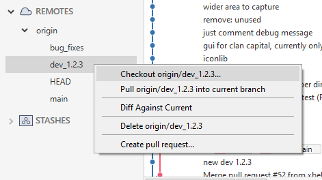
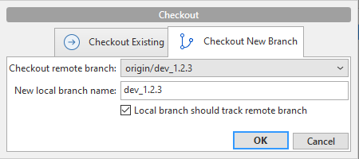
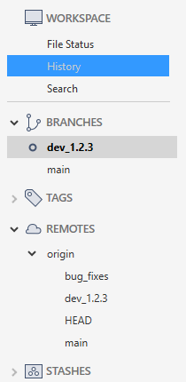
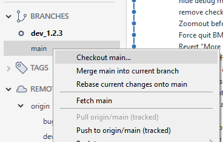
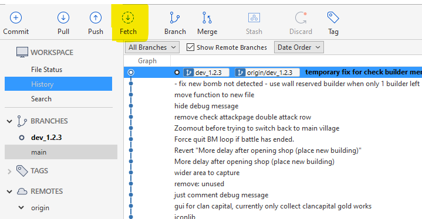

# How to switch between "Main" and "Dev" branches of xbebenk

In Sourcetree, the sidebar to your left indicates which branch or version of the mod you're currently using and also shows available branches you may switch to. 

  
The above image shows that I'm currently running on the default - main branch of the mod (highlighted in yellow)  
Highlighted in purple is the dev branch, which is available to remotely download / checkout. 

## Switching between branches  
  
Under the remotes section on the sidebar of Sourcetree, Right click on the dev branch and select "Checkout origin/dev_1.2.3..."

  
Click "OK"

  
And now, under branches you can see that we have both the dev & main branches available and currently we've chosen the dev branch as default. 
*(The bot folder in your pc automatically changes / updates files according to the branch you select. It is synced)*

  
If you want to switch between branches, you may right click on the branch you want to switch to,  and select checkout. 

  
