# The Usage guide to MyBotRun xbebenk
MyBotRun can be launched multiple different ways depending on how you'd like to use it and how many accounts you have connected.   
**Note:** If you have not launched MyBotRun before, there will not be a profiles folder in the directory where you pulled from Sourcetree. 
It is recommended that you follow the below step under Single Session if this is the first time.

## Single Session
### First Time Use Setup
* Open the folder that xbebenk was downloaded to via Sourcetree.

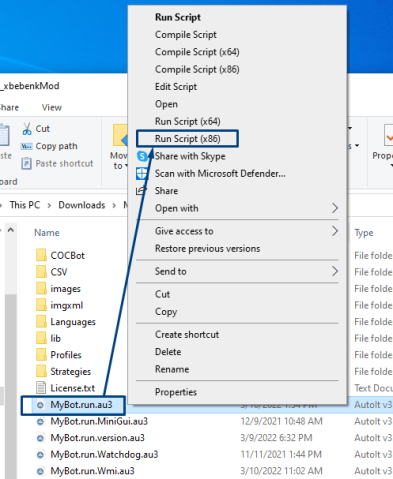  
* Right-Click on MyBot.run.au3 and select "Run Script (x86)"
  * if a User Account Control window appears, select Yes   

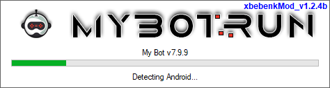  
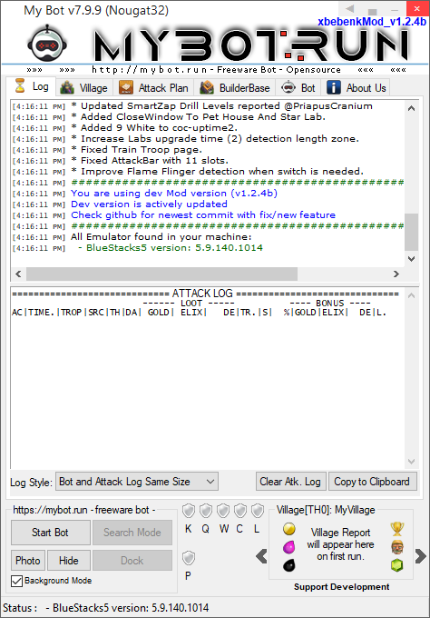  
* Once MyBotRun loads, you will see the above application.
  * Close out MyBotRun and open the source folder that Sourcetree downloaded to.

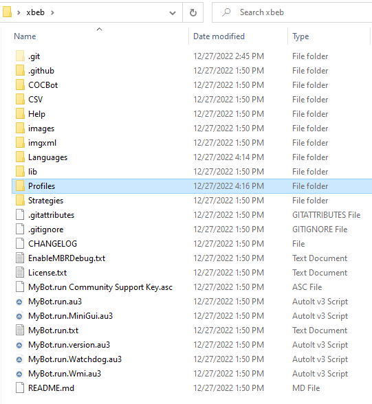  
* As seen above, there was a profiles folder created, open it.  

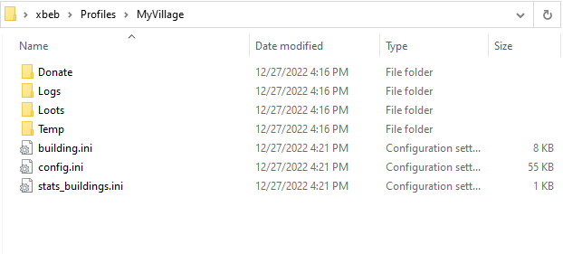  
* Open MyVillage folder (The default folder created by MyBotRun)
* **Important** The config file MUST be updated in order for Clash of Clans to launch.
* Use one of the configs from [Configs](./Configs) to update with the appropriate Amazon configs.
  * **NOTE:** The included configs in the folders are from my personal preference for the Town Hall levels. These configs can be updated within MyBotRun to meet your personal preferences.

**Relaunch MyBotRun**  

* Open the folder that xbebenk was downloaded to via Sourcetree.

  
* Right-Click on MyBot.run.au3 and select "Run Script (x86)"
  * if a User Account Control window appears, select Yes   

* Once Loaded, click Start Bot or if you used one of the configs in [Configs](./Configs), then it will start within 10 seconds. 
* Wait for Clash to load and stop the bot. 
 * **NOTE: If Clash does not load or loads a black screen, ensure that you have added the Amazon Config file settings**
* Click on the Clash account settings and connect your Supercell ID the same as you would do on any other device. 

  
* On the MyBotRun application, click on the Bot tab. 
  * Select the Profiles sub-tab and click the blue down arrow to pull the CoC Shared Prefs (
    * Clicking the blue down arrow saves your current BlueStacks Logged in clash session to the current MyBotRun Profile (MyVillage folder)

* Click Start Bot and watch it work

## Switch Accounts
* On the BlueStacks Instance where you configured the first account from above, add the number of Clash accounts that you'd like.
 * 16 Clash accounts can be loaded on each BlueStacks instance. 
 * For multiple-instances of BlueStacks, see [Multi-Instance](Usage.md#multi)  

**NOTE:** *The Below methods can be created within the MyBotRun app as well, but I find this method to be faster.*  
*I can add a guide on how to do via the app as well, if someone wants it*  

* Open the xbebenk root folder that was selected for the Sourcetree download, open the Profiles folder and copy the MyVillage folder. 
  * Personally I change MyVillage to "Default" and create copies from it so that I always have a baseline to copy if needed later.   

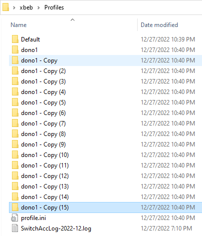  

* Paste the MyVillage folder into the Profiles folder for the amount of accounts that you would like to create. 
  * If you want to create 15 accounts, then create 15 folders
    * In my example, I named them dono# because these particular accounts will be donation accounts. 
  * Rename each folder after each one was created to the naming convention you choose (dono1, dono2, dono3, etc.)   

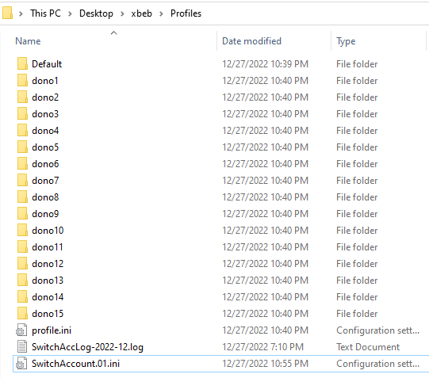  

* MyBotRun reads *SwitchAccount.01.ini* to know which accounts are to be loaded and switched to.
  * By default the SwitchAccount.01.ini file does not exist in the Profiles folder unless selected within the app. 
  * A copy of it can be found in the [Configs](./Configs) folder
    * Configured for 15 profiles named dono1, dono2, etc.

  
* Right-Click on MyBot.run.au3 and select "Run Script (x86)"
  * if a User Account Control window appears, select Yes   
* Let is start, and open BlueStacks and CoC, Stop the bot.

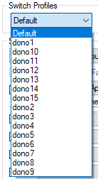  
* Click on the Bot tab and click on the Switch Profiles dropdown. 
  * The profiles created above will now be shown in the dropdown list.

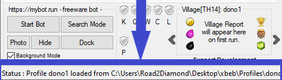  
* If not selected, Select the first account from the drop down (dono1, coc1, etc.) and wait for it to load.
  * A good way to know the account was loaded is to watch the Status at the bottom of MybotRun "*Status: Profile dono1 loaded from...*"
* On BlueStacks, go to the first logged in account that you would like to be associated with this profile and wait for it to load. 

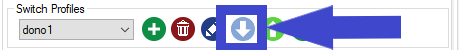  
* Select the blue down arrow to sync the account with the profile

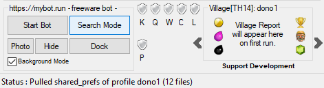  
* The Status at the bottom of MyBotRun will say "*Status: Pulled shared_prefs of profile...*"
* **Repeat this process for EACH account.** With each step, you must wait for the new profile to load as well as the account you want associated with that profile. 
  * Failure to do this will result in a failure of the bot properly switching accounts. 

## Multi-Instance

**UNDER CONSTRUCTION =]**

2. Open Command prompt

Type cmd on start menu, and open command prompt

go to your bot folder and type, autoit3 mybot.run.au3 yourprofilename

i use -a for autostart

and -ha for hide android

 
