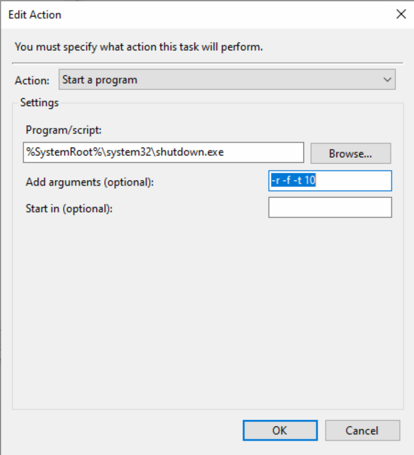

# Scheduled Tasks

## Scheduled Reboot


I personally have my bot rebooting on a daily basis since BuilderBase 2.0 arrived due to bugs and whatnot, but as it becomes more stable I will set the reboot to happen every 3 days.


*   Click Start on your Windows 10 Computer and search for Task Scheduler

    

    <figure><figcaption></figcaption></figure>

    

*   On the far right side of Task Scheduled, click on Create Task...

    

    <figure><figcaption></figcaption></figure>

    

*   Give it a name, description and check the "Run with highest privileges"

    

    <figure><figcaption></figcaption></figure>

    

* Click on the Triggers tab, click New and edit the following settings
  * Begin the Task: On a Schedule
  * Daily&#x20;
  * Start "set a date and time, usually early morning when i'm sleeping"
  * Recure every x days (Currently I have it set to every day)
  * Enabled
*   Click OK

    

    <figure><figcaption></figcaption></figure>

    

* Click on the Actions tab, click New and edit the following settings
  * Action: Start a Program
  * Program/script: `%SystemRoot%\system32\shutdown.exe`
  * Add arguments: `-r -f -t 10`
*   Click Ok

    

    <figure><figcaption></figcaption></figure>

    

## Auto Start MyBotRun

* From the Task Scheduler, click on Create Task...
*   Give it a name, description and check the "Run with highest privileges"

    

    <figure><figcaption></figcaption></figure>

    

* Click on the Triggers tab, click New and edit the following settings
  * Begin the Task: At startup
  * Check Delay task for: 5 minutes
  * Enabled
*   Click Ok

    

    <figure><figcaption></figcaption></figure>

    

* Click on the Actions tab, click New and edit the following settings
  * Action: Start a Program
  * Program/script: `C:\Users\Road2Diamond\Desktop\xbeb\Start.bat`


`C:\Users\Road2Diamond\Desktop\xbeb\Start.bat is the location of the bat file I created to launch my application. This location will differ from your system and will be within the folder that you downloaded the files from Sourcetree`

